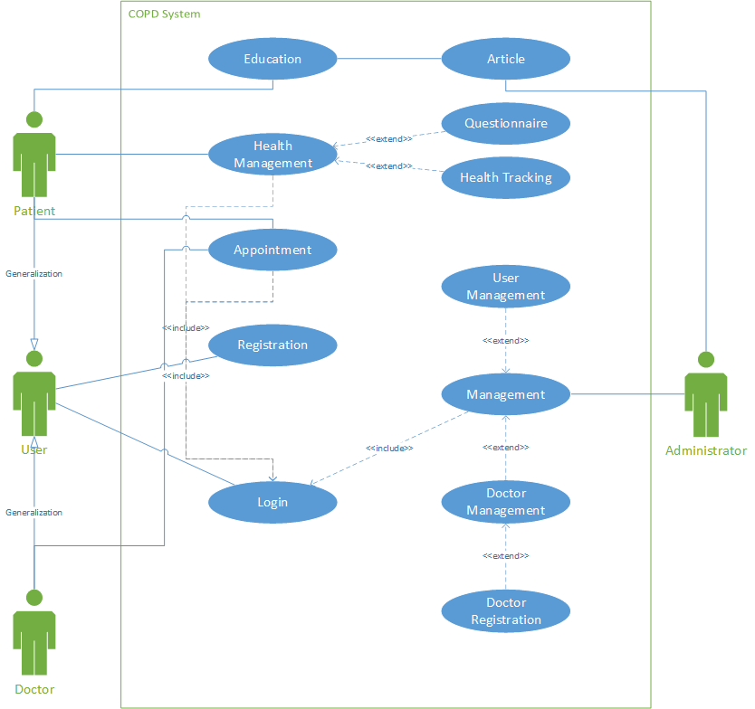

# Use Case Model

**Author**: Cyberlife

## 1 Use Case Diagram

## 2 Use Case Descriptions

Two main abstract actors are defined as User and Administrator which are corresponding to the common users and system administrators. Patient and Doctor are two actors generalized from User and inherits two basic use cases including Login and Registration.

Users must provide required personal information for the registration and set their passwords. The password needs to match what they set in the database for the execution of Login use case.

For Patient, Health Management and Appointment functions need the success of Login function. Besides, Questionnaire and Health Tracking are two extensions of Health Management use cases. Education is another use case without including Login. For Doctor, after successful Login, they can handle the appointment posted by Patient when the appointment is normal.

As a special actor, Administrator can manage the whole system including User Management and Doctor Management after Administrator satisfies Login conditions. Besides, Administrator has the privilege of registering new doctors.
