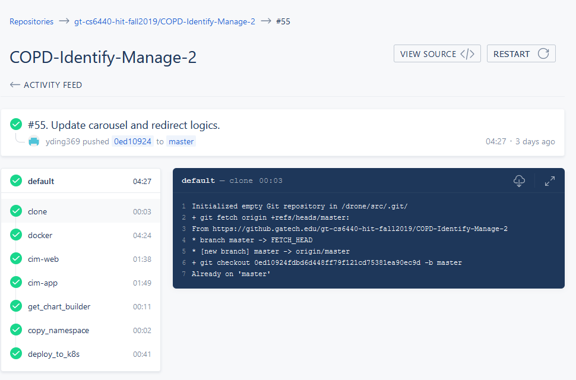
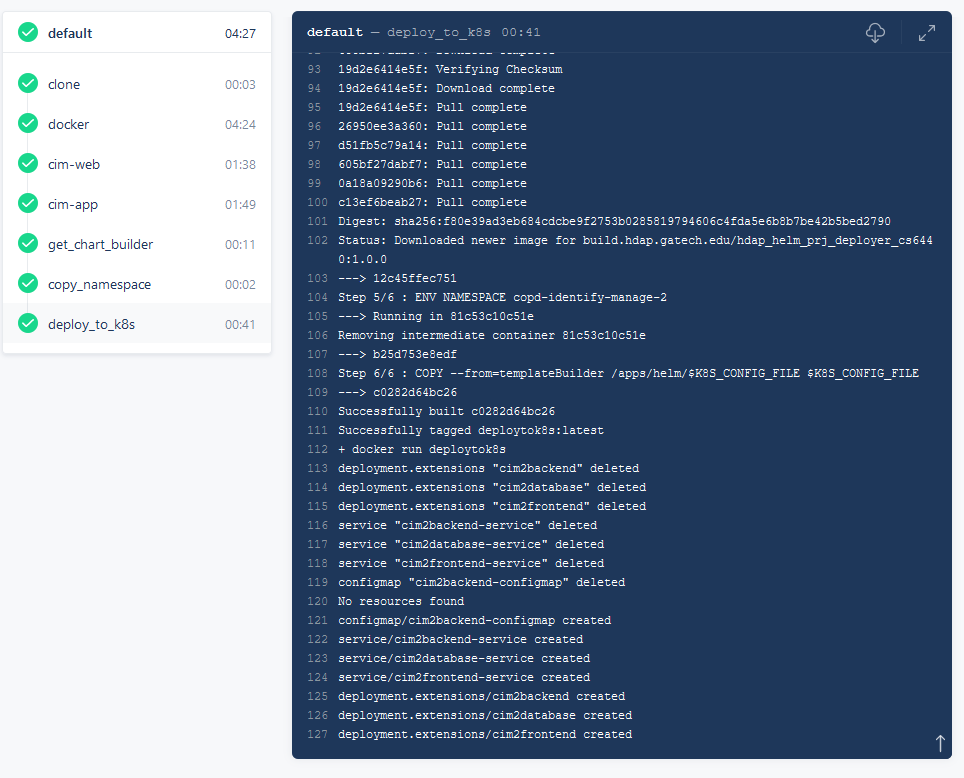
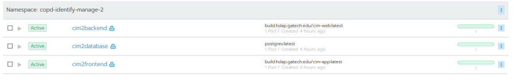
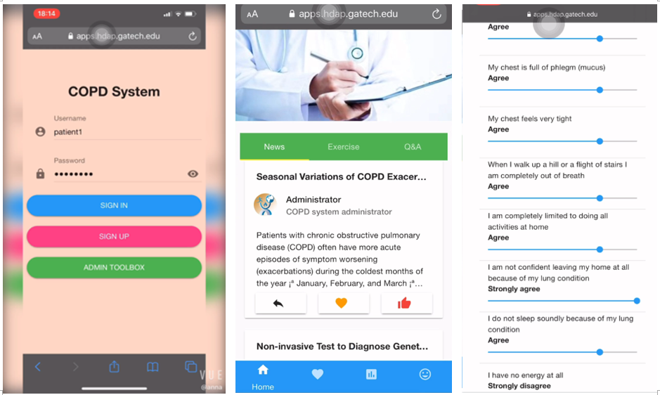
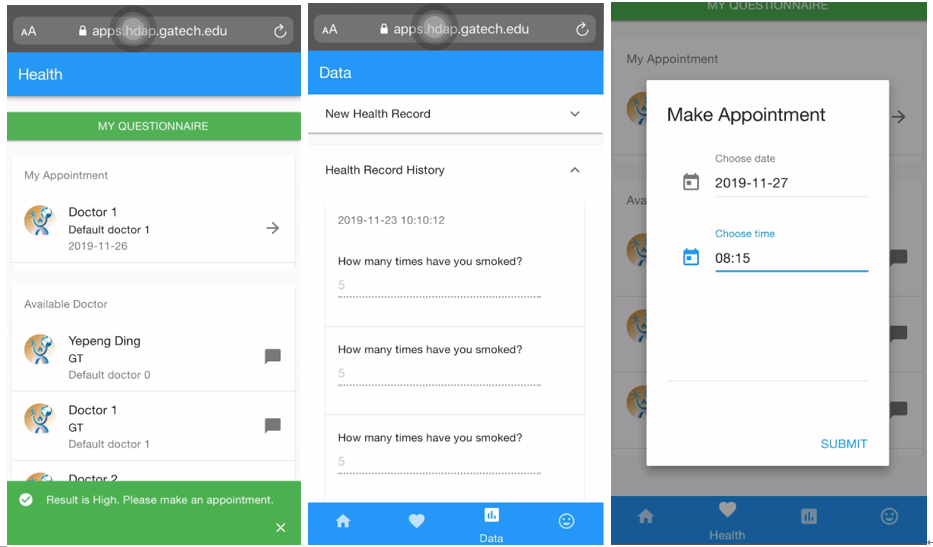

# DELIVERABLE 4 DEPLOYMENT

## COPD Diagnosis & Management App  - Project Deployment
Term: Fall 2019

Team Name: Cyberlife

Project: #48 COPD Identify & Manage 2

## Team Details

#### Team Members: 
Yepeng Ding - yding369@gatech.edu - Developer

Hua Chen - hchen659@gatech.edu  - QA

Zhihua Jin - zjin80@gatech.edu - Project Manager & QA

Zhixun Wang - zwang999@gatech.edu - Developer


#### TA Mentor: 
Ronnie Jones

#### Quick Description of Application
This is an application that would help patients self-diagnose their COPD symptoms as well as manage their health indicators. Once a high risk of COPD is diagnosed in the app, the patients could choose to make appointments with their doctors and manage these appointments. There is also a daily health record function available for patients so they can manage their health status. Last but not least, a learning section is launched to educate COPD patients and provide suggestions on their daily exercises.


## Deployment Details 

#### Drone configuration

#### Namespace
The global namespace is defined in *values.yaml*.
```
global:
  namespace: copd-identify-manage-2
```

#### Back-end application configuration
In *.drone.yml*, *environment* defines to build the back-end application in production mode and make swagger active.
```
environment:
    SPRING_PROFILES_ACTIVE: prod,swagger
```

The docker file *web-dockerfile* shown below defines the steps to build the back-end application by Maven and sets the entrypoint of the container.

```
FROM maven:3.6-jdk-8 as builder

RUN mkdir -p /web
WORKDIR /web

COPY ./web /web

# RUN mvn clean spring-boot:run -Dspring-boot.run.profiles=prod
RUN mvn clean package -Dspring-boot.run.profiles=prod

ENTRYPOINT ["java","-Djava.security.egd=file:/dev/./urandom","-jar","/web/target/copdmanage-0.0.1-SNAPSHOT.jar"]
```

In *values.yaml*, the configuration information of the back-end application is shown below.
```
backend:
  name: cim2backend
  port: 80
  replicaCount: 1
  proxy:
    incomingPath: /cim2web/
    containerPath: "/"
  image:
    repository: build.hdap.gatech.edu/cim-web
    tag: latest
    pullPolicy: Always
  env:
    SPRING_PROFILES_ACTIVE: prod,swagger
```

#### Front-end application configuration
The docker file *app-dockerfile* shown below defines the steps to build the front-end application by Node.js.

```
FROM node:12.13.0 as builder

RUN mkdir -p /app
WORKDIR /app

COPY ./app /app
RUN rm -rf node_modules
RUN rm -f package-lock.json

RUN npm install
RUN npm run build
```

In *values.yaml*, the configuration information of the front-end application is shown below.
```
frontend:
  name: cim2frontend
  port: 80
  replicaCount: 1
  proxy:
    incomingPath: /cim2app/
    containerPath: "/"
  image:
    repository: build.hdap.gatech.edu/cim-app
    tag: latest
    pullPolicy: Always
```


#### Load balancer configuration
Load balancer is defined in the docker file *app-dockerfile* shown below and configured with customized *default.conf*.

```
FROM nginx:1.17.4
COPY --from=builder ./app/dist /usr/share/nginx/html/
COPY ./nginx/default.conf /etc/nginx/conf.d
```

#### Database configuration
In *values.yaml*, the configuration information of the database is shown below.
```
database:
  name: cim2database
  port: 5432
  replicaCount: 1
  image:
    repository: postgres
    tag: latest
    pullPolicy: Always
```

### Link to drone.yml
https://github.gatech.edu/gt-cs6440-hit-fall2019/COPD-Identify-Manage-2/blob/master/.drone.yml

### Link to values.yaml
https://github.gatech.edu/gt-cs6440-hit-fall2019/COPD-Identify-Manage-2/blob/master/values.yaml

### Link to any other deployment files 
https://github.gatech.edu/gt-cs6440-hit-fall2019/COPD-Identify-Manage-2/tree/master/Deliverable%204%20Deployment/Deployment%20File

## Github Repository
Link: https://github.gatech.edu/gt-cs6440-hit-fall2019/COPD-Identify-Manage-2/tree/master/Deliverable%204%20Deployment

Branch: master

Final Commit ID: 1025df72040241fcf7582a6f5a2ca649440ee3ef

## Deployed Application
### Drone Build Logs Screenshot



### Rancher Container Running Screenshot


### Application Screenshot (Running)



### Steps to run app and login information
The app link on HDAP is here: https://apps.hdap.gatech.edu/cim2app/
 
Login user name and password for patients:
 
Username | Password
--- | --- | 
patient | patient
patient1 | patient1
patient2 | patient2

Once logged in, the four buttons below would guide the user to "Main Page: patient education", "COPD self-diagnosis survey and doctor reservation", "Health Record Management" and "Setting".
 
Login user name for doctors:

Username | Password
--- | --- | 
doctor | doctor
doctor1 | doctor1
doctor2 | doctor2


In the doctor portal, after clicking on the second button, the doctors can see reservations from patients.
 
The admin box on the front page is for publishing new articles.
 
