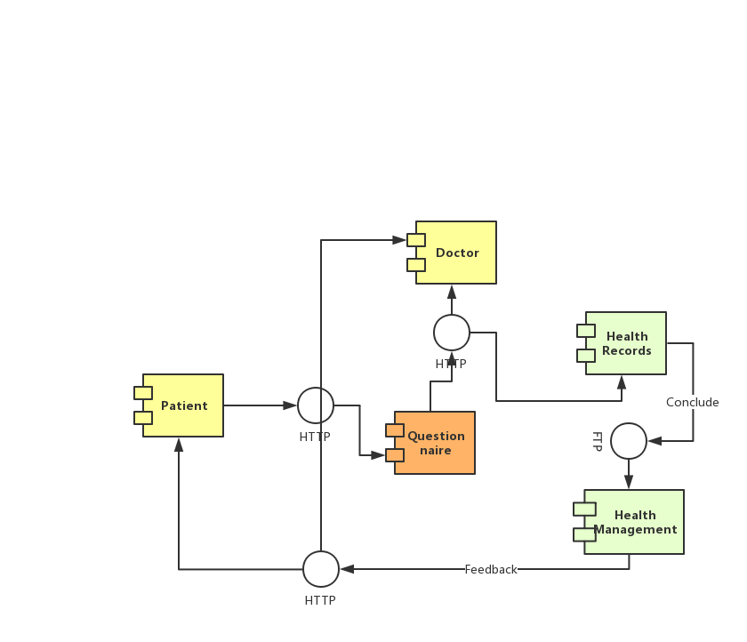
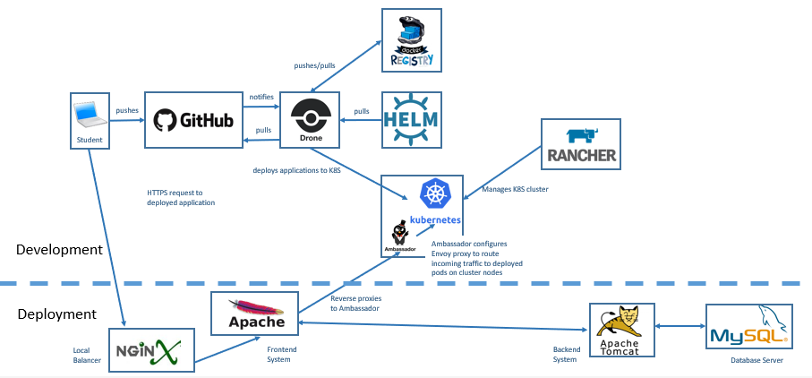
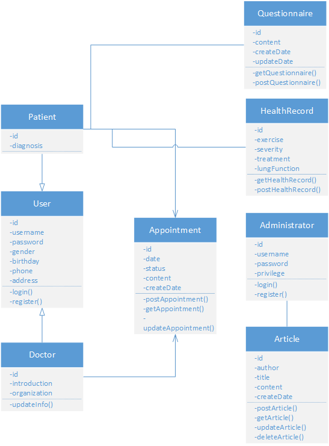
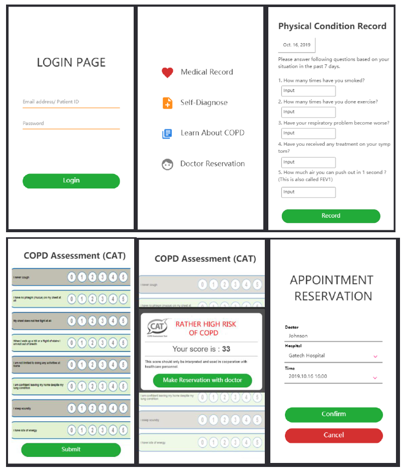
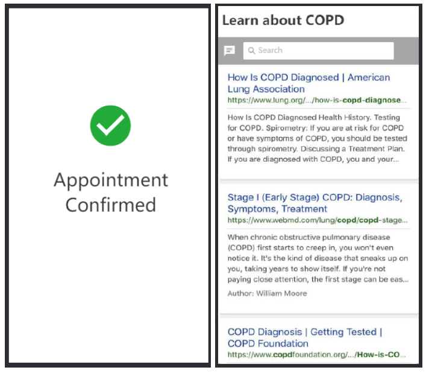

# COPD Diagnosis & Management App 
Term: Fall 2019

Team Name: Cyberlife

Project: #48 COPD Identify & Manage 2

## Team Details

#### Team Members: 
Yepeng Ding - yding369@gatech.edu - Developer

Hua Chen - hchen659@gatech.edu  - QA

Zhihua Jin - zjin80@gatech.edu - Project Manager & QA

Zhixun Wang - zwang999@gatech.edu - Developer

Github Link: https://github.gatech.edu/gt-cs6440-hit-fall2019/COPD-Identify-Manage-2

## 1 Design Considerations
 

### 1.1 Assumptions

**Assumption**

•	Human resource availability: All key project team members are available and have the necessary skills and knowledge to work on the project.
•	Scheduling accuracy: The set deadlines and milestones are achievable and the project can be finished on time.
•	Performance of development tools: All necessary servers, data sources, software and hardware and are available whenever you need them.
•	Upper management support: We have the support from our mentor, who will back us up when issues arise.

**Background**

COPD are often misdiagnosed since its symptoms can be similar to other diseases. Meanwhile, HDAP is a software platform designed to support health-oriented research projects. We could make use of this platform to develop an application that can help patients self-dragonize, manage their symptoms and make reservations with their doctors.

**Dependency**

End-to-Start: demand analysis should be finalized to start prototype design.
Prototype design should be finalized before the application development start.

Start-to-Start: The application development must start before testing & debugging can start.
The application development must start before HDAP deployment can start.
Each phase should start before the write-up of deliverable can start.

### 1.2 Constraints

**Constraints**

*Time frames: Limited time (about 6 week to complete the project)

*Gaps of knowledge: Not every member has past experience in software development.

*Resources: The type, amount, and availability of resources to perform the project work may not be fully available when we need them.

*Activity performance: Apart from weekly deliverable, the final application should be working on HDAP, so we should figure out how to utilize several analytic tools and transfer application developed in other hosting environment to HDAP.

### 1.3 System Environment

**Software**
HDAP HTTP; GitHub; Drone; Docker Registry; Helm; Kubernetes; Drone; Rancher;Nginx;Apache;Tomcat, etc.

**Hardware**
Student Computer; HDAP FHIR server, etc.

## 2 Architectural Design

### 2.1 Component Diagram

### 2.2 Deployment Diagram

## 3 Class and Other Diagrams

## 4 User Interface Design

