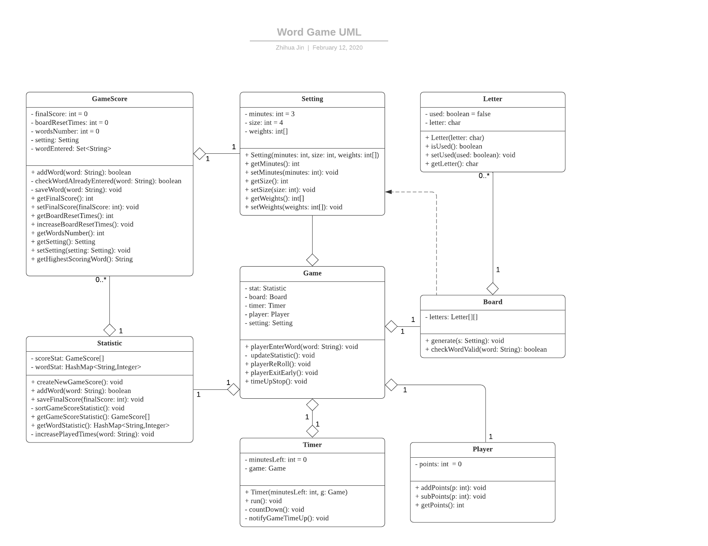
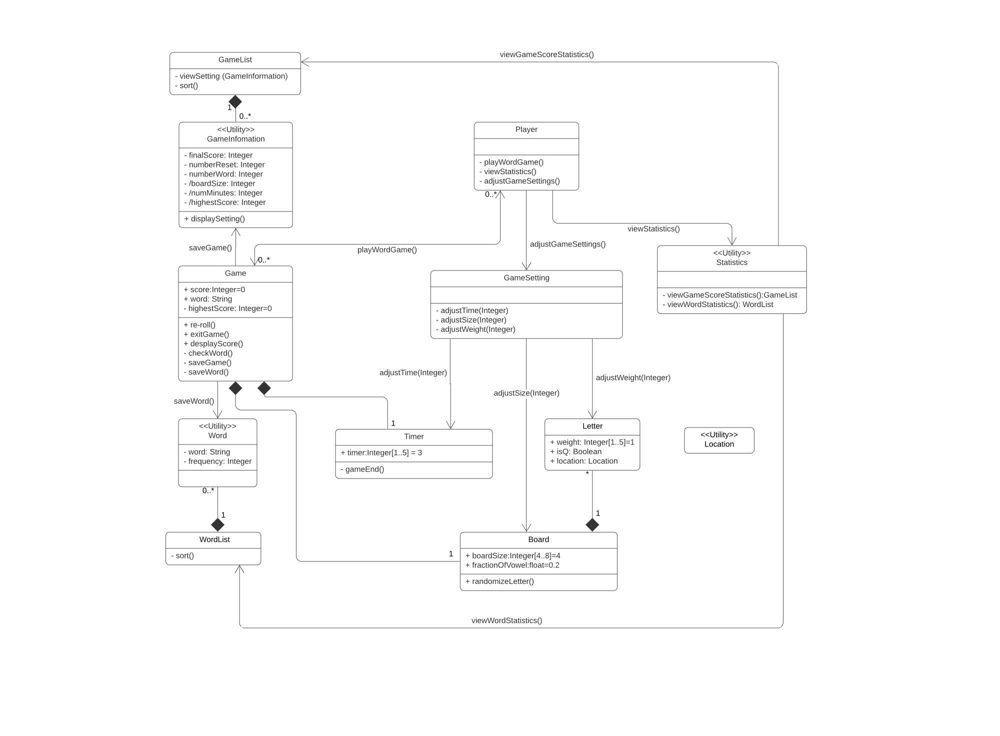
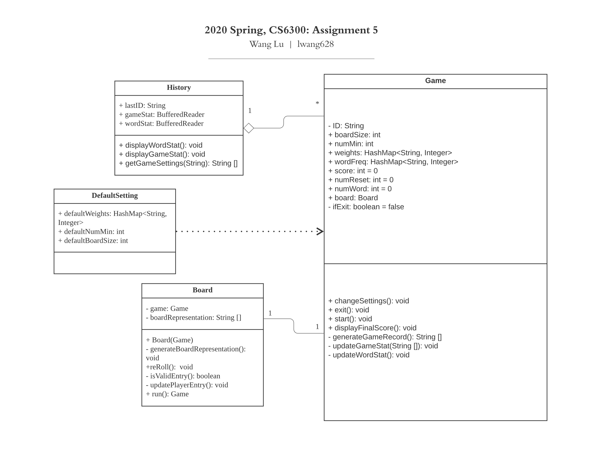
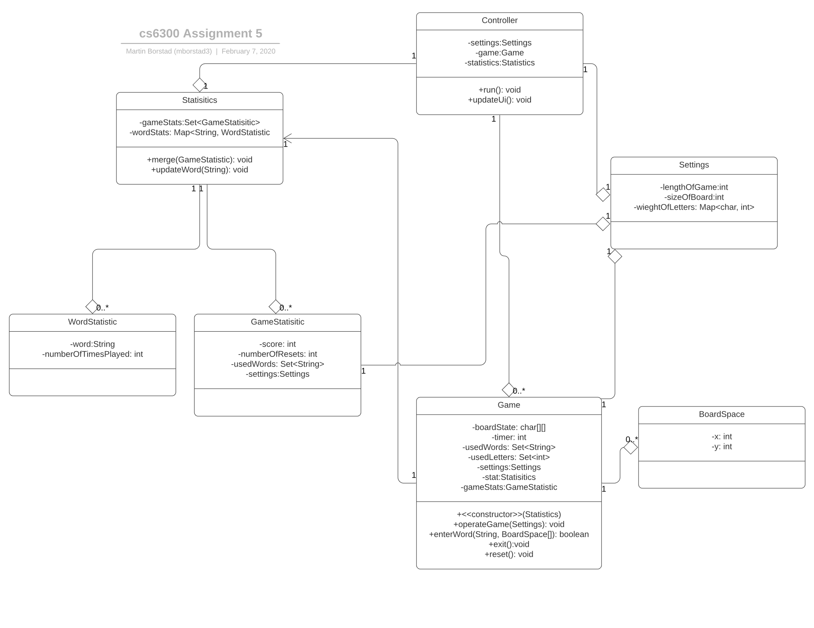
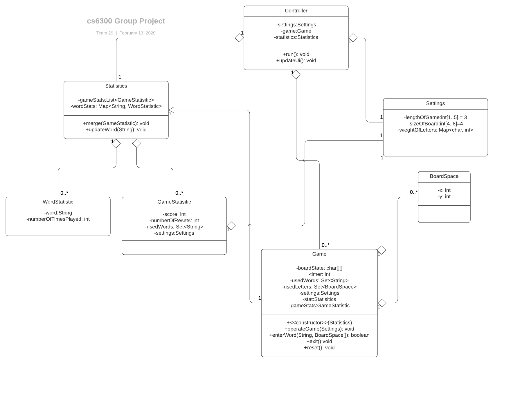

# Deliverable 1–Preliminary Work-Team 29

This is the UML design of a simple, single-player word game for our  new customer, George P. Burdell.

## Individual designs

### Design 1  (zjin80)

Pros

Generally speaking, it is a comprehensive UML. The design is very explict and clear about how it maps to the requirements, with many details included. Although getter and setter is not compulsory, they are specified in the diagram. It seems that this design tries to include as much information as possible. It captures the board as its own unique class because it opens up a decent ability to limit the board logic only to the board. It also implements every things in struction in details. The names of attributes and methods in each class are well considered. Thus, readers can follow the logic and understand how methods can be implemented easily. 

Cons

It is somehow redundant. Timer, Gamescore and letter can be incorporated into other classes. Take *letter* for instance, it can be represented by hashmap. There wasn't a clear set of ownership over particular resources because of how encompassing the classes are.  For example, the Statistics class handles both the current score and historical scores.  It also introduces unneeded levels of indirection that were a result of directly mapping to the requirements, which may work, but may complicate implementations. Some relations between each class may be more precise. For example the relation between Timer and Game may be a typo.  

### Design 2 (czheng74)

Pros

The design is very explict and clear, and it even shows how the interactions work. We appreciate how the statistics are clearly shown in the two different workflows. The single point of entry through the player class is also worth praising. Moreover, this member refers to the Udacity course video and adds operations such as *Viewstatistics()* between different classes. Certainly, the actual relationships in Assignment 5 are more complicated than the video example, at least this is a commendable attempt. 

Cons

At first glance, it may seem a little confusing how various things were actually accomplished. For example, the board exists, but how the board is actually stored is not clear.  It also uses utility classes where utility methods are more appropriate. Granted, it will work, it just adds to the amount of code that needs to get both written and, if this was a real long term project, maintained. Some additional attributes also need to be added to the board design, such as whether a word is used. More attributes may be needed to checkWord methods in game class, since it is a complicated fuction. Some classes may also be implemented in a simpler and more concise way, for example the frequency of word. Anyway, through the member's explanation, these aspects turn out to be clearer. 

### Design 3 (lwang628)

Pros

This is the most consice design among 4 of us. The design seems too simple at first glance but all the important parts are included. Furthermore, this member explains how the app works in the documentation. It is a very stateful design and the vast majority of the logic is kept within only a couple classes. We like the centralized point of entry and point of responsibility. Like, there is never any confusion on whose method to call. We also love the way the author's idea to use hashmap to handle the weight of each letter and the weight of each word.

Cons

Using buffered reader as an attribute felt kind of odd. It also hides how the stats are really stored as the design places them into a CSV rather than a java object.  Because of how stateful it is, I worry about basic operations like reset because you need to clear a decent amount of state without clearing all the state. It is not a deal breaker, but would be annoying to write. The default setting class may not be necessary. 

### Design 4 (mborstad3)

Pros

It is a very simplistic design and heavy depends on the idea of singletons to control state.  We also like how it is possible to throw the game object away and make a new game without losing things like the statistics history. The way that the designer uses aggregation relationship to simplify the design is also what we appreciate. For example, the information of setting was shared in three classes, Controller, Game and Gamestatstics classes. It makes the overall UML a lot more concise. The Boardspace class, which is used to check the validation of word, is also compact.

Cons

It is a high level design and assume the controller accesses things using various getters.  It also hides most state changes under a single method. The usedLetters method under game was assuming you can map an entire 2D board to a single integer, which is possible, but is confusing to do. Some relations are not correctly represented. For example, the direction of the aggregation relationship is wrong. Also, the default value of settings should be provided, as they are mentioned in the requirement.

## Team Design

After our team discussion, we decided to make modifications based on the forth design, since it can implement all the requirements in a  concise and decent way. The revisions we did are: 
1. correct the directions of aggregation relation 
2. add the default values
3. Use List instead of Map for WordStats

The controller class will control the game (i.e., starting) and update the stored information based on the action of players. The game class implements the game playing (e.g., entering words, checking the validation of words, and ending of the game). The Setting class has the attributes for the game setting information, at which the player can modify the setting information. The Statistics class has two sub-classes: GameStatistics and WordStatyistics. The player can access the statistics information through the statistics class.

The final design, compared to *Design 1*, has a centralized control flow which is implemented by a coordinator class called "Controller". While a similar centralized role can also be found in *Design 2* (the "Player" class in *Design 2*), its power is weakened by much more complicated inter-class relationship in this design. *Design 3*, in contrast, suffers from oversimplicity problem by putting heavy responsibility on "Board" and "Game" class, and adding more pressure on resetting process. Besides, our group members also took very different approches in their initial design about how to implement functionalities like: countdown, storing word frequency, representation of board state, representation of letter weights.

Interestingly, we found a few commonalities that all designs share despite so much differences mentioned above: 
1. "Game" should be the class carry the heaviest functionality responsibility; 
2. Methods implement functionality similar to checking the validity/updating game state after valid entry contain most of engineering details;
3. Some sort of control flow (or the interaction between classes) must be handled with more care. (However, we found this relationship can not be well reflected in a UML class diagram.)

## Summary

We learnt a lot in this design discussion process. First, in this process, we understand how people with diverse background may think differently about the same problem. For example, software engineers may think about a software design problem from a high-level aspect. In practical work, they would mainly focus on the necessary attributes and core functions to achieve the requirements. More focus will be put on information sharing or the relation between each class. 

Secondly, from this discussion, we also found some optimal ways to solve complex sub-problems and reviewed our command of Java knowledge. For example, we found that we can store the weight of each letter and the frequency of each word in hashmap and list separately. 

Last but not least, for teamwork, in this process, we have a better understanding of how to manage a group project more efficiently. We set up a regular meeting time and assigned the workload clearly. Through several online tools, we will be able to communicate more effectively and conquer difficulties when facing problems. 

