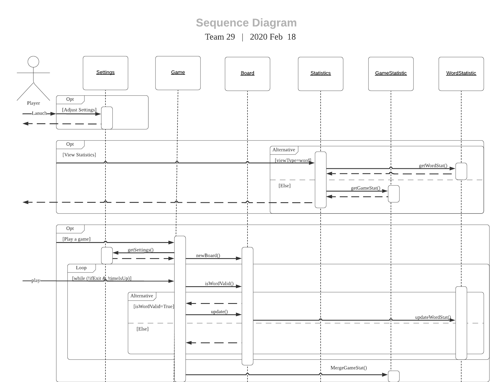
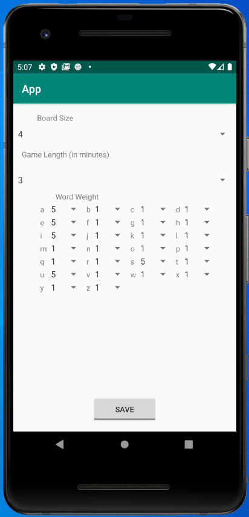
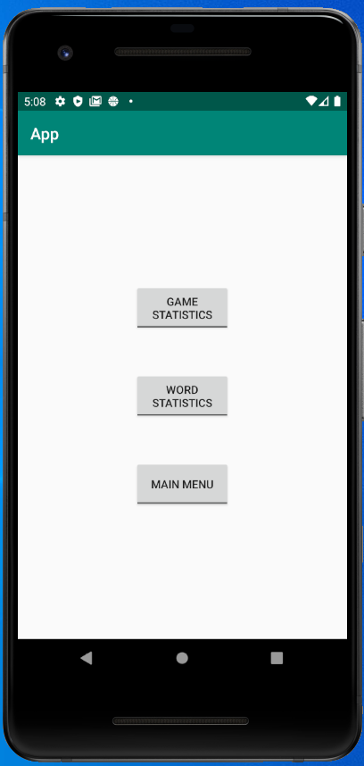

# Design Document

**Author**: \<Team 29\>     
**Version**:\<3.0-0305-bfD4\>       
**Description:**\<Third version. Proofread on Mar 5th. Before deliverable 4 submission ddl>

## 1 Design Considerations

### 1.1 Assumptions
1. Single player, which means that the system will not store any player related information or logistics, and that the statistics are aggregated from ALL HISTORICAL DATA regardless of player identity. 

2. Limited gaming number, which means that the user(s) should not expect the app to scale over extreme quantity of data, or the app is expected to perform well only when it is launched LIMITED TIMES (perhaps less than 100K), as scalability is not priority in this design. 

3. No validity checkup of wording. That's to say, we do not have an internal dictionary for the player entries to be checked against. In fact, we simply assume every word a player entered is legitimate, which often is not the case in real world, unintentionally or intentionally.

4. Tested under Android environment and only on a limited number of models. Testing would be carried out in Android Studio using its emulator functionality. Popular models like Nexus 5 would be used in testing. Due to inherent fragmentation of Android ecosystem, only 60%(+) of Android mobile phones on market are guaranteed to be able to replicate our testing results. However, it is not a sure thing whether it behaves as expected on every Android model.

### 1.2 Constraints

As stated in *1.1 Assumptions*, the main constraints of the design are: 
**(1) lack of player logistics;
(2) lack of scalability; 
(3) lack of legitimacy guarantee**.

For example, we have A and B who are good friends and like to play games with each other. Friend A and friend B may want to know individual game statistics so that they can compete. This is impossible within the current system, unless they download the app on individual phones and stick to playing the game on their own phone; suppose friend A becomes fanatic about the game and keeps playing it, he will eventually be in a situation where he suffers from significant lag (as the app is not designed to hold so much data); friend B is shocked by A becoming an expert of this game (not so surprising to us, though), B can cheat by just typing random combination of letters as a 'word' (suppose all letters are adjacent and used only once). As a result, B can beat the honest player A without actually being good at this game.

In sum, the constraints elaborated in scenarios above disqualify the app from being a potential commercial release. In fact, this app is more like a demo-of-concept design in its nature: **''a simple word game that may be used by a single player''**, as stated clearly in Assignment5 guidelines.

### 1.3 System Environment

As explained in *1.1 Assumptions*, the development and testing are both done in Android Studio. Only a bunch of popular models (Nexus 5 API 29, etc) were used and tested against. It's not guaranteed that the app will behave as well due to inherent fragmentation of Android ecosystem.

## 2 Architectural Design
### 2.1 Component Diagram

### 2.2 Deployment Diagram

For this simple system, there will be only one hardware devices involved, which is the android phone installed with the app. No cloud services, no distant database services nor user data remote backup. Instead, every piece of information will be stored and accessed locally - on the exact device where the system exists. 

To put it more clearly, there will be no information exchange/interaction in any format between the android device and its external environment; each piece of data generated will be the one and only copy stored and used locally; any disruption of the current installation will simply lead to permanent loss of historical statistics. Since all components will be deployed on one device (which works as both client and server) , there is no point to draw the deployment diagram. 

## 3 Low-Level Design

### 3.1 Class Diagram

### 3.2 Other Diagrams
Here we use sequence diagram to show the behavioural characteristics of our app: 

## 4 User Interface Design
1.Launch page:   

2.Game page:  

3.Settings page:  

4.Statistics Page:  

5.Word Statistics:  

6.Game Statistics:  

