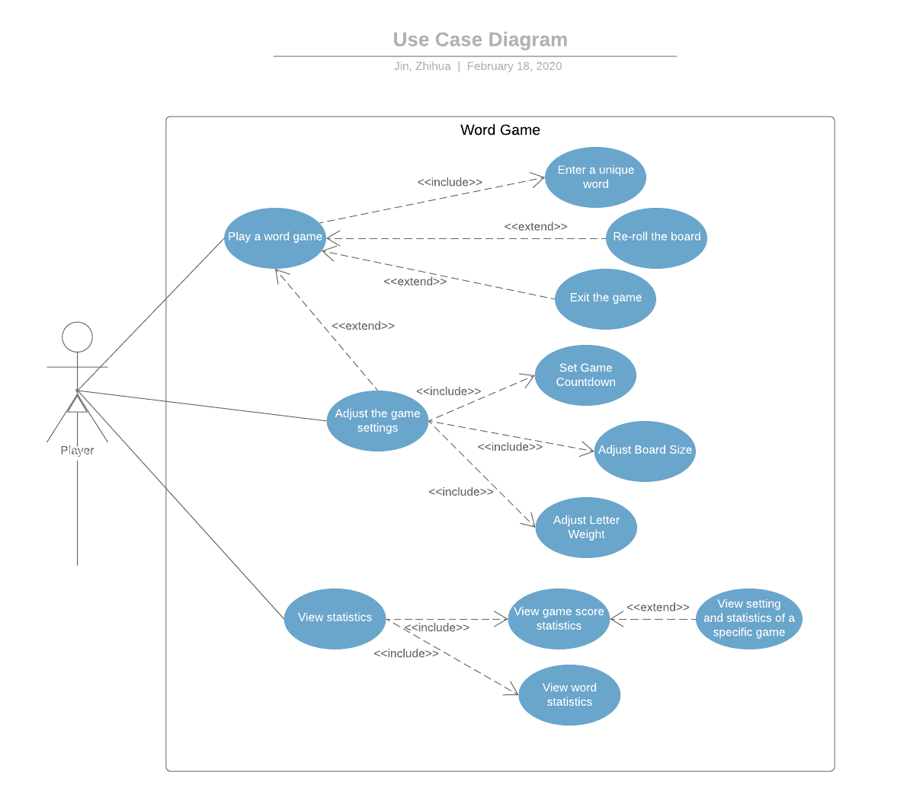

# Use Case Model

**Author**: Team 29  
**Version**:\<3.0-0303-bfD4\>         
**Description:**\<Third version. Done Mar 3rd. Proofread on Mar 5th. Before deliverable 4 submission ddl. >   

## 1 Use Case Diagram

## 2 Use Case Descriptions

**Play a word game**
- Requirements: The use case must allow the user to play a word game.
- Pre-conditions: Before the use case is run, the user must have launched the app on the device. 
- Post-conditions: The word game starts with word board and countdown timer shown according to the setting  

- Scenarios: 
  - Normal: 
    1) The user sends a request to the system to play the game by hitting the "NEW GAME" button
    2) The system generates the game board according to the Settings 
    3) The user is shown a ‘board’ of randomly generated letters, and a timer on the interface
    4) The user starts playing the game by entering a unique word according to guideline before the time is up
    5) The final score for the game will be displayed when the game ends 

  - Alternate 1: 
    1) The user sends a request to the system to play the game by hitting the "NEW GAME" button
    2) The system generates the game board according to the Settings 
    3) The user is shown a ‘board’ of randomly generated letters, and a timer on the interface. 4) During the playing process, the user chooses to re-roll the board 
    5) The user starts playing the game once again by entering a unique word according to guideline before the time is up  
    6) The final score for the game will be displayed when the game ends 

  - Alternate 2: 
    1) The user sends a request to the system to play the game by hitting the "NEW GAME" button
    2) The system generates the game board according to the Settings 
    3) The user is shown a ‘board’ of randomly generated letters, and a timer on the interface. 4) During the playing process, the user chooses to exit the game early 
    5) The final score for the game will be displayed

**Enter a unique word**
- Requirements: The use case must allow the user to enter a unique word made up of two or more letters on the board. 
- Pre-conditions: The user has clicked on the "NEW GAME" button and the word game starts. Word board and countdown timer are shown according to the settings. The word entered must contain only letters from the board that are each adjacent to the next and a single letter on the board may not be used twice. 
- Post-conditions: The user successfully enters the unique word that meets the requirement and the score for that word is calculated and recorded.
- Scenarios: 
  - Normal:
  1) The user clicks on the letter one by one to form a word and clicks on "SUBMIT"
  2) The system checks that the word entered is unique according the guideline. It must contain only letters from the board that are horizontally, vertically, or diagonally adjacent to the next. And a single letter on the board cannot be used twice. 
  3) The score for that word is recorded. The score is 1 point per letter. Word statistics is also updated. 

  - Exceptional: 
  1) The user clicks on the letter one by one to form a word and clicks on "SUBMIT"
  2) The system finds that the word entered is not unique according the guideline. 
  3) The system pops out error message indicating the error
  4) The score for that word is not recorded.  

**Re-roll the board**
- Requirements: The use case must allow the user to re-roll the board. 
- Pre-conditions: The user has clicked on the "NEW GAME" button and the word game starts. Word board and countdown timer are shown according to the settings.  
- Post-conditions: The user successfully re-roll the board at a cost of 5 points. The board is re-created in the same way it is generated, replacing each letter. The timer will not be reset or paused. The new score of player is calculated and recorded.
- Scenarios:  
  - Normal:
  1) The user clicks on "RESET"
  2) The system re-creates the board using same setting as before but letters on the board are changed. 
  3) The player has a new score. 5 points should have been decreased.

**Exit the game early**
- Requirements: The use case must allow the user to exit the game early. 
- Pre-conditions: The user has clicked on the "Play a word game" button and the word game starts. Word board and countdown timer are shown according to the settings.  
- Post-conditions: The user successfully exit the game. The final score for the game will be displayed. 
- Scenarios:  
  - Normal:
  1) The user clicks on "EXIT GAME"
  2) The system stops the countdown and ends the game. 
  3) The final score for the game is displayed to the player.  

**View statistics**
- Requirements: The use case must allow the user to view statistics. 
- Pre-conditions: Before the use case is run, the user must have launched the app on the device. 
- Post-conditions: The user is able to view both game statistics and word statistics. 
- Scenarios:  
  - Normal:
  1) The user clicks on "STATISTICS"
  2) The system displays two choice "GAME STATISTICS" and "WORD STATISTICS"
  3) The user chooses "GAME STATISTICS". 
 
  - Alternate:  
  1) The user clicks on "STATISTICS"
  2) The system displays two choice "GAME STATISTICS" and "WORD STATISTICS"
  3) The user chooses "WORD STATISTICS". 

**View game statistics**
- Requirements: The use case must allow the user to view game statistics, in descending order by final game score. 
- Pre-conditions: The user has clicked on the "STATISTICS" button.  
- Post-conditions: The user successfully views the list of scores for the game it plays. Information displayed include a. The final game score b. The number of times the board was reset c. The number of words entered in the game 
- Scenarios:  
  - Normal:
  1) The user clicks on "GAME STATISTICS"
  2) The system displays the list of scores and relevant information 

  - Alternate 1:
  1) The user clicks on "GAME STATISTICS"
  2) The system displays the list of scores and relevant information 
  3) The user clicks on any of game scores on the list
  4) The user view the detailed information of that specific game

  - Alternate 2: 
   1) The user clicks on "GAME STATISTICS"
   2) The system displays nothing since there is no game played yet

**View word statistics**
- Requirements: The use case must allow the user to view word statistics. 
-- Pre-conditions: The user has clicked on the "View statistics" button.  
- Post-conditions: The user successfully views the list of words used in the games. Information displayed include a. The word b. The number of times the word has been played, across all games
- Scenarios:  
  - Normal:
  1) The user clicks on "WORD STATISTICS"
  2) The system displays the list of scores and relevant information 

  - Alternate: 
  1) The user clicks on "WORD STATISTICS"
  2) The system displays nothing since there is no game played yet  

**View setting and statistics of a specific game**
- Requirements: The use case must allow the user to view  setting and statistics of a specific game. 
- Pre-conditions: The user has clicked on "GAME STATISTICS".  
- Post-conditions: The user successfully views the setting and statistics of a specific game. The information includes: a. the settings for that game’s board size, number of minutes b. the highest scoring word played in the game. For words score with equal number of points, the first word played game will be displayed. 
- Scenarios:  
  - Normal:
  1) The user clicks on a specific score displayed in "GAME STATISTICS"
  2) The system displays the setting of that game and word with highest score 

  - Alternate: 
  1) The user clicks on a specific score displayed in "GAME STATISTICS" with a score 0
  2) The system displays nothing since there is no point gained and no word recorded   

**Adjust the game settings**
- Requirements: The use case must allow the user to adjust the game settings.
- Pre-conditions: Before the use case is run, the user must have launched the app on the device.  
- Post-conditions: The user successfully adjusts the game settings
- Scenarios:  
  - Normal:
  1) The user clicks on "SETTINGS" button
  2) The system displays three settings that can be adjusted for the game: a. Length of game; b.Size of Board ; c. Weight of word. Each setting has different numerical range. 
  3) The user adjusts these settings by choosing different numbers within the range.
 
  - Alternate: 
  1) The user clicks on "SETTINGS" button
  2) The system displays three settings that can be adjusted for the game: a. Length of game; b.Size of Board ; c. Weight of word. Each setting has different numerical range. 
  3) The user does not adjust these settings. The setting remains unchanged.
 

**Set Game Countdown**
- Requirements: The use case must allow the user to adjust the length of game, which will be reflected in the game as a countdown timer. The default setting of number of minutes is 3.
- Pre-conditions: The user must have clicked on "SETTINGS".  
- Post-conditions: The user successfully adjust the length of game.
- Scenarios:  
  - Normal:
  1) The system displays the setting that can be adjusted for length of game. 
  2) The user adjusts the setting by choosing different integers from 1 to 5.

  - Alternate: 
  1) The system displays the setting that can be adjusted for length of game. 
  2) The user does not adjust the setting. The setting of game length remains unchanged 

**Adjust Board Size**
- Requirements: The use case must allow the user to adjust the board size in game settings. The default setting is 4.
- Pre-conditions: The user must have clicked on "SETTINGS".  
- Post-conditions: The user successfully adjust the Board Size.
- Scenarios:  
  - Normal:
  1) The system displays the setting that can be adjusted for Board Size. 
  2) The user adjusts the setting by choosing different integers from 4 to 8.

  - Alternate: 
  1) The system displays the setting that can be adjusted for Board Size. 
  2) The user does not adjust the setting. The setting of board size remains unchanged

**Adjust Letter Weight**
- Requirements: The use case must allow the user to adjust the letter weight in game settings. The default setting is 1. In short, a letter with higher weight is more likely to be chosen than letter with lower weight.
- Pre-conditions: The user must have clicked on "SETTINGS".  
- Post-conditions: The user successfully adjust the letter weight.
- Scenarios:  
  - Normal:
  1) The system displays the setting that can be adjusted for letter weight. 
  2) For different letter, the user can adjust the setting by choosing different integers from 1 to 5 .

  - Alternate: 
  1) The system displays the setting that can be adjusted for letter weight. 
  3) The user does not adjust these settings. The setting of letter weight remains unchanged. 

<!--stackedit_data:
eyJoaXN0b3J5IjpbLTE4MzQ2MjczNF19
-->
