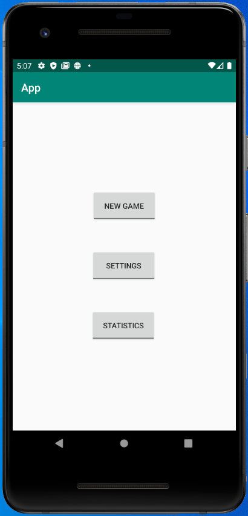
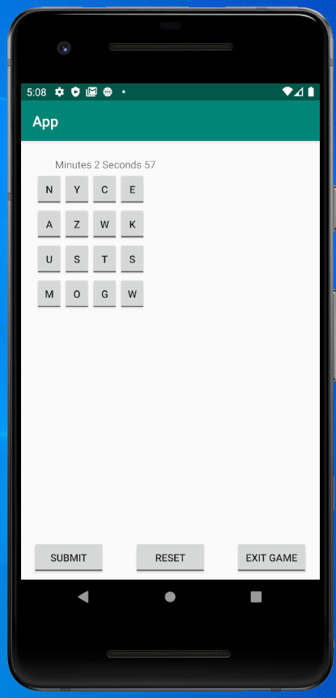
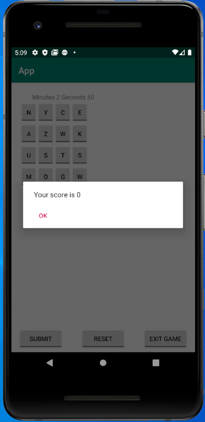
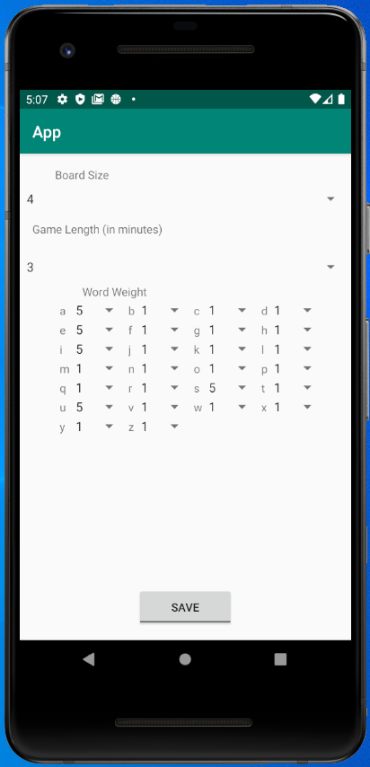
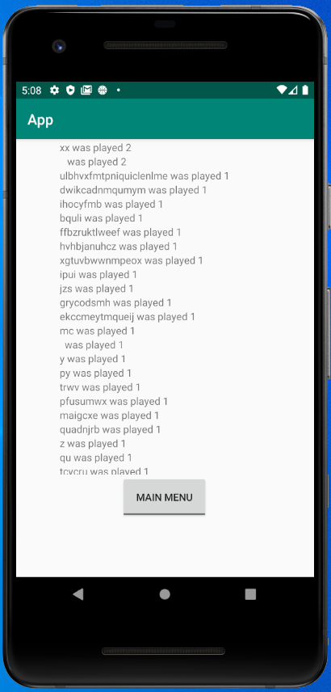
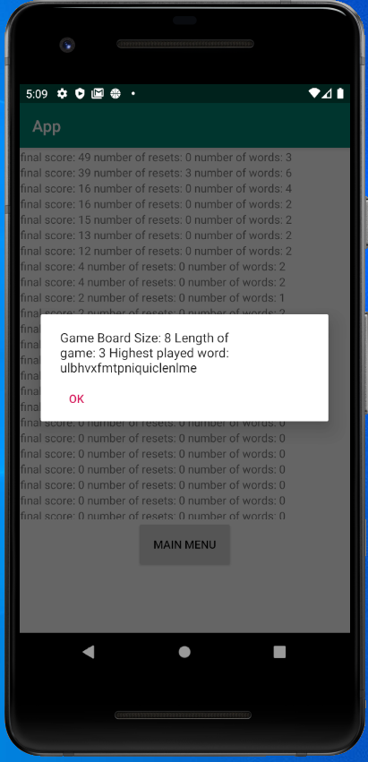

# User Manual

**Author**: Team 29  
**Version**:\<3.0-0305-bfD4\>  
**Description:**\<Third version. Proofread on Mar 5th. Before deliverable 4 submission ddl>

## 1 Introduction

This is a simple, single-player word game app WordFind6300. It is designed for our new customer, George P. Burdell. In the game, player will be presented a game board. In limited time, the player has to enter unique words made up of two or more letters on the board. The word must only contain letter adjacent to the next (horizontally, vertically, or diagonally). Each word is worth 1 point per letter (except 'Qu' counting as 2 letters). Board size, time limit and word weight can be adjusted. When the game ends, the final score and relevant statistics will be recorded. In-detail instruction will be given in following paragraphs.

## 2 App Description
**1. Launch page:**  
When you launch this game app, you can see there are 3 buttons available, corresponding to three functions:
(1) "NEW GAME" - Play a word game 
(2) "SETTINGS" - Adjust the game settings
(3) "STATISTICS" - View statistics 

**2. Game page:**  
- The game page is shown in the following figure:

- If you click on "NEW GAME" button, then the new game will start with default setting. A game board full of randomly selected words will be displayed. In limited time, you have to enter unique words made up of two or more letters on the boardto gain points. To do so, you just need to click on letter on the board one by one that can make up a meaningful word. When all letters are clicked in the correct sequence, press "SUBMIT" button to get points. 

- Keep in mind that **the word must only contain letter adjacent to the next (horizontally, vertically, or diagonally). A single letter on the board may not be used twice**. 

- Each word is worth 1 point per letter (except 'Qu' counting as 2 letters). When the game ends, the final score and relevant statistics will be recorded in "STATISTICS".

- By default, the board size is 4x4. The timer counting in second is on the upper-left. The default time given is 3 minutes. For each letter, the weights of the letters of the alphabet defaults to 1, which means that each letter has same likeliness to be displayed. But this assumption is only valid when two letters are consonants or both vowels.On the whole, ⅕ (rounded up) of the letters will be vowels (a,e,i,o,u). ⅘ will be consonants.
- Board size, time limit and word weight can be adjusted in "SETTINGS".
- If you think the current board is not what you like or has no more word available, you can press "RESET" button to reset the game. The board will be re-created with replaced letter. The previous score will be kept. However, 5 points will be deducted. The timer will not be reset or paused.
- If you do not want to play the game anymore, feel free to press "EXIT GAME" button any time. The score will still be recorded.
- At the end of the game, when the time is over or you chooses to exit, the final score for that game will be displayed on the screen: 

**3. Settings page:**  
- The setting page is shown in the following figure:

- The system displays three settings that can be adjusted for the game: 
a. Board Size; 
b. Game Length (in minutes); 
c. Word Weight. 
- You can adjust these settings by clicking the drop-down menu and choosing different numbers within the range. 
- Each setting has different numerical range. The board size is between 4(x4) and 8(x8). The game length (in minutes) is from 1 to 5. The weights of each letter are between 1 and 5.  
- ⅕ (rounded up) of the letters will be vowels (a,e,i,o,u). ⅘ will be consonants.  
- If two letter are both consonants or both vowels, a higher weight means higher likeliness to be chosen and displayed. For example, a weight of 5 is 5 times as likely to be chosen compared to a letter with a weight of 1. 

**4. Statistics Page:**  
- The statistics page is shown in the following figure:

- It has two functions: "GAME STATISTICS" and "WORD STATISTICS".

**5. Word Statistics:**  
- The "WORD STATISTICS" page is shown in the following figure:

- Here you can view the list of words used in the games. Information displayed include: 
a) The word  
b) The number of times the word has been played, across all games  

**6. Game Statistics:**  
- The "GAME STATISTICS" page is shown in the following figure:

- Here you can view the list of scores for the game it plays. Information displayed include:
a. The final game score   
b. The number of times the board was reset    
c. The number of words entered in the game   

- To view the detailed information of a specific game, you just need to click on the line that game is shown. Then the setting and statistics of a specific game will pop out. 
- The information includes: 
a) the settings for that game’s board size, number of minutes   
b) the highest scoring word played in the game.   
For games scoring the same, the game played earlier (smaller ID) will be displayed.  

  
